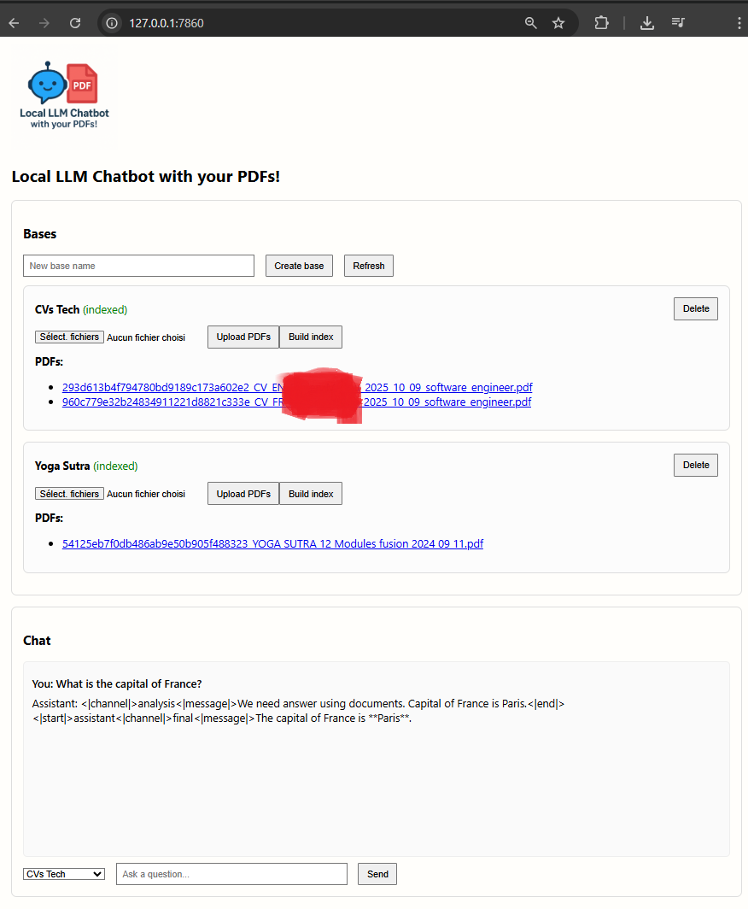
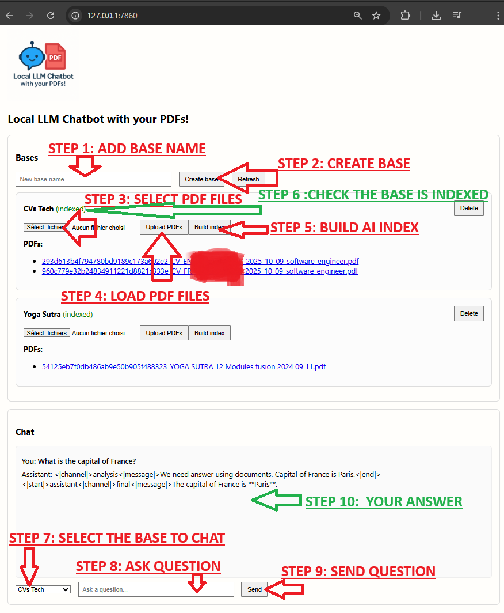

# Local LLM Chatbot with your OWN PDFs!


## Introduction

This project creates a fully local chatbot that answers questions using your own PDF documents. It builds a vector database from PDFs with ChromaDB (RAG), retrieves relevant passages for each question, and queries a local LM Studio–compatible model for the final answer. Nothing leaves your machine: PDFs, embeddings, and inference all run locally.



## Steps to ask question locally



## Setup

1. Create and activate a virtual environment

```bash
python -m venv .venv
# Windows (PowerShell)
. .venv/Scripts/Activate.ps1
# macOS/Linux
source .venv/bin/activate
```

2. Install dependencies

```bash
pip install -r requirements.txt
```

Notes:

- The `requirements.txt` includes optional PyTorch wheels for CUDA 12.6. Adjust to your GPU/CPU as needed.
- If you are on a different CUDA version (or CPU only), install the matching PyTorch build from the official wheel index and then switch back to PyPI (as shown in the file).

## Files overview

- `main_rag_chat.py` (main): RAG chat app that builds a local ChromaDB vector store from PDFs in `./pdf`, then answers questions by retrieving relevant passages and querying the LM Studio–compatible API.
- `server.py` + `static/` (web UI): FastAPI backend with a simple VueJS UI to upload/select PDFs, choose DB path/collection, build the vector DB, and chat against it.
- `util_api_call.py` (utility): Minimal client that calls an LM Studio–compatible API. It can list models or send a single prompt to a selected model and print the completion.
- `util_cuda_detection.py` (utility): Small helper to display CUDA and GPU info as detected by PyTorch.

## Configuration

Both scripts can auto-detect a reachable base URL, especially when running under WSL. You can also control connection and model via environment variables:

- `LMSTUDIO_HOST` (default `127.0.0.1`)
- `LMSTUDIO_PORT` (default `1234`)
- `LMSTUDIO_SCHEME` (default `http`)
- `LMSTUDIO_MODEL` (default `local-model`)
- `LMSTUDIO_TIMEOUT` and `LMSTUDIO_MAX_TOKENS` are additionally read by `03_rag_chat_v02.py` if not provided via CLI.

Make sure an LM Studio–compatible server is running and serving the `/v1` endpoints on the configured host/port.

## Usage

### 1) Simple API call (`util_api_call.py`)

List models (no prompt):

```bash
python util_api_call.py --timeout 180
```

Send a single prompt:

```bash
python util_api_call.py \
  --prompt "What is the surface area (km²) of Quimper, Rennes, Plougonven, and Ploumilliau in Brittany?" \
  --model local-model \
  --max-tokens 150 \
  --timeout 240
```

Optional connection overrides:

```bash
python util_api_call.py --host 127.0.0.1 --port 1234 --scheme http
```

### 2) RAG over PDFs (`main_rag_chat.py`)

Place your PDFs in the `./pdf` directory. The script will store embeddings in a persistent ChromaDB directory `vectordb/`.

First run (or when you add/replace PDFs), you can force a fresh index:

```bash
python main_rag_chat.py --force-reindex --timeout 240 --max-tokens 512
```

Then ask questions interactively. The script will retrieve the most relevant passages from your PDFs and query the model. You can also now specify explicit files and a custom DB path/collection:

```bash
python main_rag_chat.py --timeout 240 --max-tokens 512 \
  --pdf-folder ./pdf \
  --pdf-files ./pdf/a.pdf ./pdf/b.pdf \
  --db-path ./vectordb --collection docs \
  --use-existing    # skip indexing if collection exists; error if missing
```

### 3) Quick start script (`start.sh`)

On macOS/Linux or Git Bash on Windows:

```bash
./start.sh --timeout 240 --max-tokens 512
```

This script creates a virtual environment if missing, installs dependencies, ensures `./pdf` exists, and runs `main_rag_chat.py` with any extra flags you pass.

### 4) Docker

Build the image:

```bash
docker build -t local-rag-chat .
```

Run with your PDFs mounted read-only and a persistent vector store:

```bash
docker run --rm -it \
  -v $(pwd)/pdf:/app/pdf:ro \
  -v $(pwd)/vectordb:/app/vectordb \
  -p 7860:7860 \
  -e LMSTUDIO_HOST=host.docker.internal \
  -e LMSTUDIO_PORT=1234 \
  local-rag-chat
```

Flags:

- `--force-reindex`: delete and rebuild the vector database from PDFs.
- `--timeout`: API read timeout (seconds).
- `--max-tokens`: maximum number of generated tokens.
- `--stream`: stream model output for progressive display.

### 5) Web UI

Run the FastAPI server (serves the VueJS UI on the same port):

```bash
uvicorn server:app --host 127.0.0.1 --port 7860 --reload
```

Then open `http://localhost:7860` in your browser.

Features:

- Configure `db_path` and `collection`.
- Upload specific PDFs and/or set a PDF folder.
- Build/update the vector DB (with optional force reindex).
- Ask questions in the chat; answers are generated via LM Studio using retrieved context.

## Troubleshooting

- If the client cannot reach the server, verify the host/port and that your LM Studio–compatible server is running. On WSL, the scripts try several candidates (default gateway, DNS nameserver, `host.docker.internal`).
- If embedding fails, ensure PyTorch and `sentence-transformers` are correctly installed and that your environment matches your hardware (CUDA vs CPU).
- If no PDFs are found, create the `./pdf` folder and add at least one `.pdf` file.
